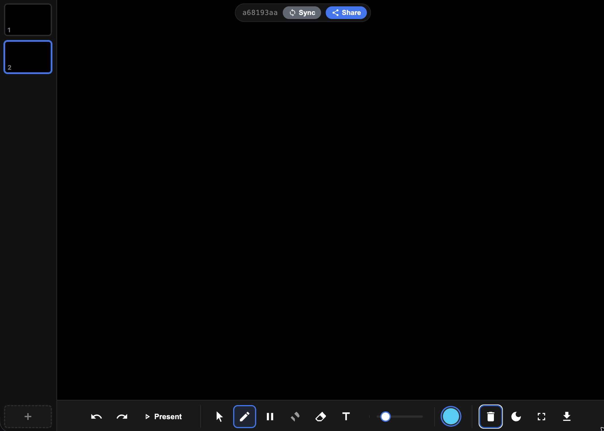

# Distributed Whiteboard

A real-time collaborative whiteboard for creating training videos. Draw on your iPad (presenter) and have it appear instantly on any viewer's screen — perfect for screen recording with tools like Screen Studio.



## Quick Start

```bash
npm install
npm start
```

The server prints your local network URLs:

```
Distributed Whiteboard Server
─────────────────────────────
Presenter: http://yourhost.local:3000/presenter
Viewer:    http://yourhost.local:3000/viewer
IP:        http://192.168.x.x:3000
Local:     http://localhost:3000
```

Open `http://localhost:3000` for the landing page.

## How It Works

1. Open the **presenter** URL on your iPad (or any browser)
2. A unique **session ID** is generated and shown in the URL (bookmarkable)
3. Click **Share** to copy the viewer link — send it to anyone
4. Open the **viewer** URL on your Mac or another device
5. Draw on the presenter — it appears on all viewers in real-time
6. Record the viewer window with Screen Studio for clean captures

## Features

### Drawing Tools
- **Pen** — thin line with pressure sensitivity (Apple Pencil supported)
- **Marker** — thick strokes
- **Highlighter** — semi-transparent overlay
- **Eraser** — draws in the background color
- **Text** — tap to place a text cursor, type on keyboard, typewriter-style. Change color mid-typing without losing the input.
- **Adjustable line width** — slider control for stroke thickness

### Color Palette
10 colors in a compact popup picker (tap the current color circle to expand):
- **LK Cyan** (#1FD5F9), **LK Blue** (#002CF2) — LiveKit brand colors
- **White**, **Black**, **Gray** — high contrast, great for green screen
- **Red**, **Yellow**, **Orange**, **Purple**, **Pink** — all green-screen safe

### Select & Move
- **Select tool** (cursor icon) — click elements to select them
- **Multi-select** — click additional elements to add to selection
- **Drag to move** — drag selected elements to new positions (syncs to viewers)
- **Delete** — red X button on selection, or Delete/Backspace key
- **Recolor** — change color of selected elements by clicking a color swatch
- Click empty space to deselect all

### Multiple Boards
- **Sidebar thumbnails** — visual previews of each board
- **Add/delete boards** — "+" button to add, right-click to delete
- Boards are independent — each has its own strokes, undo history

### Themes
Three canvas themes (cycle with the moon icon):
- **Dark** — black canvas, light-colored strokes (default)
- **Light** — white canvas, dark-colored strokes
- **Green Screen** — pure #00FF00 chroma key background for video compositing

### Replay / Present Mode
- **Present button** — clears the canvas and replays your drawing stroke by stroke
- Strokes animate progressively (looks like they're being drawn in real-time)
- Text animates with a typewriter effect (~7.5 chars/sec)
- **Playback controls** replace the toolbar during replay:
  - Play / Pause
  - Step Forward (animates one element, then auto-pauses)
  - Step Back (instant)
  - Jump to Start / End
  - Speed: 0.5x, 1x, 2x, 4x
  - Cancel (exit replay, restore full board)
- Starts in **paused state** so you can adjust speed before playing
- Replay syncs to viewers — they see the animated playback

### Sessions
- Each presenter gets a unique **session UUID** in the URL
- Sessions are independent — multiple presenters can run simultaneously
- **Bookmarkable** — revisit the same session URL to reconnect
- Session bar shows: session ID, **Sync** button, **Share** button, **viewer count**
- **Sync** pushes the presenter's exact current state to all viewers
- Empty sessions are cleaned up after 30 minutes

### Save & Load
- **PDF export** — multi-page PDF (one page per board) with embedded whiteboard data. Opens normally in any PDF viewer AND can be reloaded into the whiteboard.
- **SVG export** — vector export of the current board
- **JSON export** — raw backup of all board data
- **Load from file** — import a previously saved PDF or JSON to restore all boards, strokes, and text. Then replay it.

### Export / Download Menu
Click the download icon in the toolbar:
- SVG (current board)
- PDF (all boards) — includes embedded data for reload
- JSON (backup)
- Load from file... (PDF or JSON)

### Viewer
- **Read-only mirror** — shows exactly what the presenter draws
- **Auto-sync** — board switches, theme changes, moves all propagate
- **Late-join** — new viewers receive the full board state on connect
- **Board indicator** — shows which board is being viewed
- **Auto-reconnect** — reconnects if the WebSocket drops
- **Download** — viewers can also export SVG/PDF/JSON
- **Fullscreen** — button in the bottom-right corner
- **No session = friendly error** — shows a message instead of a broken page

### Offline / Serverless Support
- If WebSocket isn't available (e.g. hosted on a static platform), the presenter can still draw locally
- Shows "Offline — drawing locally" status
- Auto-reconnects when a server becomes available

### Preferences
Tool, color, and brush width are saved to `localStorage` — they persist across page refreshes.

## Architecture

```
distributed_whiteboard/
├── server.js              # Express + WebSocket server
├── public/
│   ├── index.html         # Landing page
│   ├── presenter.html     # Presenter UI
│   ├── viewer.html        # Viewer UI
│   ├── css/
│   │   └── styles.css     # Themes, responsive layout, playback bar
│   └── js/
│       ├── whiteboard.js  # Core canvas engine (draw, select, replay, export)
│       ├── presenter.js   # Presenter logic (tools, boards, WS, controls)
│       ├── viewer.js      # Viewer logic (WS receive, render)
│       ├── jspdf.umd.min.js  # PDF generation (loaded on demand)
│       └── pako.min.js    # Compression for PDF data embedding
├── tools/
│   └── mermaid2whiteboard.html  # Mermaid diagram → whiteboard JSON converter
└── deploy/
    ├── apache-whiteboard.conf   # Apache vhost config with WebSocket proxy
    └── DEPLOY.md                # Deployment guide for DigitalOcean
```

- **Backend:** Node.js, Express, `ws` (WebSocket)
- **Frontend:** Vanilla JS + Canvas API (no frameworks, no build step)
- **Sync:** WebSocket with session-scoped channels
- **State:** In-memory per session on the server
- **Coordinates:** All points stored as normalized 0–1 ratios (resolution-independent)

## Mermaid Converter

Convert Mermaid diagrams into whiteboard JSON files with a hand-drawn style.

Access at `/mermaid` or open `tools/mermaid2whiteboard.html` directly.

1. Paste Mermaid syntax (flowchart, sequence diagram, etc.)
2. Click **Convert** — see preview
3. Adjust jitter (hand-drawn wobble), stroke width, theme
4. Click **Download JSON**
5. In the whiteboard, use **Load from file** to import
6. Hit **Present** to replay the diagram drawing itself

## Deployment

### Local (development)
```bash
npm install
npm start
# or: npm run dev (auto-restart on changes)
```

### Production (DigitalOcean / any VPS)
See `deploy/DEPLOY.md` for full instructions. Summary:
```bash
rsync -avz --exclude node_modules --exclude .git ./ root@server:/var/www/whiteboard.yourdomain.com/
ssh root@server "cd /var/www/whiteboard.yourdomain.com && npm install --production"
pm2 start server.js --name whiteboard
```

Requires Apache or Nginx with WebSocket proxy headers. See `deploy/apache-whiteboard.conf`.

## Usage Tips

- **iPad:** Enable Do Not Disturb to keep notifications out of your recording
- **Screen Studio:** Record just the viewer browser window for a clean capture
- **Dark mode** works well for technical diagrams
- **Green screen mode** for compositing drawings over video — use black/white/cyan for best contrast
- **Present mode** for recording clean replays without mistakes
- **Save as PDF** before closing — your drawing is embedded in the PDF and can be reloaded later
- **Bookmark the presenter URL** to return to the same session
